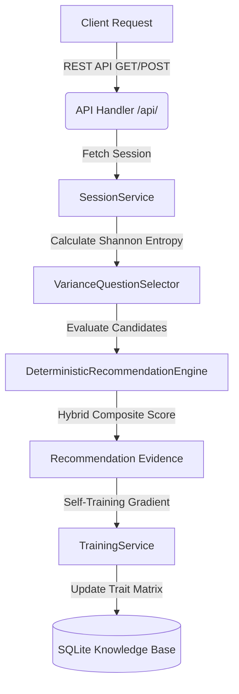

# Sorts.me (Central Engine)

[](LICENSE)
[](https://www.python.org)
[](https://sortling-bot.onrender.com/api/clubs)

> **Central recommendation engine, dynamic question selector, club knowledge base, and REST API for the Sortling campus discovery ecosystem.**

**Sorts.me** houses the core algorithmic intelligence of the Sortling platform. It transforms multi-dimensional student preferences into ranked club recommendations using Information Gain decision trees, weighted vector dot products, cosine similarity, and online gradient reinforcement learning.

---

> [!NOTE]
> ## CORE ALGORITHM ARCHITECTURE
>
> Sorts.me is structured into 5 foundational components designed for sub-millisecond evaluation speed and high-precision matching across campus organizations.

---

## 🏗️ Central Engine Structure

```text
Sorts.me
├── Recommendation Engine   (Multi-Tier Hybrid Scoring & Cosine Matching)
├── Question Engine         (Shannon Entropy Information Gain Decision Trees)
├── Club Knowledge Base     (Verified Registries & Crawler Import Pipelines)
├── Scoring                 (Online Gradient Reinforcement & Weight Decay)
└── API                     (CORS REST API for Cross-Platform Integration)
```

---

## 🏛️ System Architecture



---

## 🌟 Key Features

* 🧠 **Multi-Tier Hybrid Scoring**: Evaluates candidate clubs using a 5-term composite score formula:
  $$\text{Score} = (0.45 \times \text{Dot}) + (0.30 \times \text{Cosine}) + (0.15 \times \text{Overlap}) + (0.10 \times \text{Commitment}) - (0.10 \times \text{Disinterest}) + \text{TieBreaker}$$
* 🌳 **Adaptive Question Selection**: Dynamically selects questions that maximize Information Gain ($\Delta H$) using dynamic softmax temperature scaling ($T = 5.0 + 1.5 \times N$).
* 📊 **Zero Flat Tie Scores**: Incorporates micro-entropy tie-breakers based on verification confidence and club ID hashes to ensure every club receives a unique, distinct rank.
* 🔄 **Online Gradient Reinforcement**: Implements decaying learning rates ($\text{LR} = \frac{0.05}{1 + 0.1 \times N}$) to adjust trait matrices from student feedback without over-fitting.
* 🌐 **High-Performance REST API**: Provides cross-origin REST endpoints for `/api/university`, `/api/clubs`, `/api/events`, `/api/sessions/start`, and `/api/sessions/answer`.

---

## 📂 Codebase Structure

* **`DeterministicRecommendationEngine` ([deterministic_engine.py](sorts/core/recommendation/deterministic_engine.py)):** Calculates composite match scores across weighted interest dot product, profile cosine similarity, trait overlap ratios, and disinterest penalties.
* **`VarianceQuestionSelector` ([variance_selector.py](sorts/core/questions/variance_selector.py)):** Implements Shannon Entropy calculations over viable candidate pools to select optimal next questions.
* **`TrainingService` ([training_service.py](sorts/services/training_service.py)):** Ingests feedback deltas and applies online gradient adjustments to club trait weights.
* **`ClubService` & `SessionService` ([session_service.py](sorts/services/session_service.py)):** Manages session lifecycles, question progression, and recommendation persistence.
* **`APIHandler` ([api.py](sorts/web/api.py)):** Serves JSON REST API endpoints with full CORS headers for external web clients.

---

## 🛠️ Quickstart Guide

1. Clone the repository and set up a virtual environment:
   ```bash
   git clone https://github.com/sorts-me/sorts.me.git
   cd sorts.me
   python -m venv .venv
   .venv\Scripts\activate
   pip install -r requirements.txt
   ```

2. Run unit test suite:
   ```bash
   pytest
   ```

3. Start local development server:
   ```bash
   python main.py
   ```

---

## 📝 REST API Reference

| Endpoint | Method | Payload / Params | Description |
| :--- | :--- | :--- | :--- |
| `/api/university` | `GET` | `?slug=mahindra` | Returns university profile details. |
| `/api/clubs` | `GET` | `?university_id=1` | Returns list of verified campus clubs. |
| `/api/events` | `GET` | `?university_id=1` | Returns active campus hackathons and events. |
| `/api/sessions/start` | `POST` | `{"university_id": 1}` | Initializes new quiz session and returns Question 1. |
| `/api/sessions/answer` | `POST` | `{"session_id": "...", "question_id": 1, "option_id": 2}` | Submits answer and returns next question or final top matches. |

---

## 📜 License

Licensed under the MIT License.
