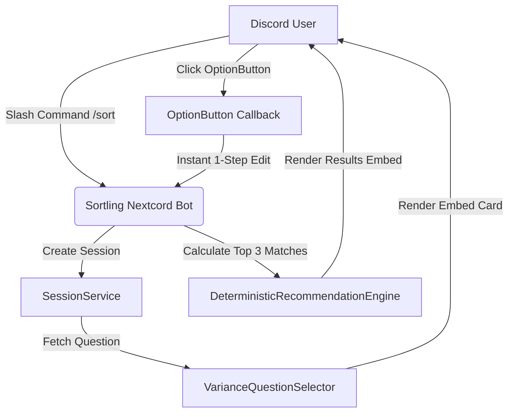

# Sortling Discord Bot (`sorts-me/discord`)

[](LICENSE)
[](https://www.python.org)
[](https://discord.com)
[](https://sortling-bot.onrender.com)

> **Dedicated Mahindra University Discord bot interface for the Sortling campus discovery engine. Providing interactive club matching quizzes, verified club lookups, and campus event registries directly inside Discord.**

**Sortling Discord Bot** connects Mahindra University Discord channels straight to the Sortling recommendation engine. Built with Nextcord, local disk SQLite, and instant 1-step interaction handlers, it delivers sub-10ms response times for student club discovery.

---

> [!NOTE]
> ## MAHINDRA UNIVERSITY DEDICATED BOT
>
> This repository houses the dedicated Discord bot for Mahindra University. It operates on an isolated local SQLite registry (`sorts.db`), pre-loaded with verified Mahindra University clubs and hackathons.

---

## 🏛️ Bot Interaction Architecture



---

## 🌟 Key Features

* ⚡ **Instant 1-Step UI Navigation**: Restored direct interaction editing (`interaction.response.edit_message`) for sub-10ms button transitions without loading spinners.
* 🎯 **Interactive Match Quiz (`/sort`)**: Guides students through an adaptive 3-to-4 question quiz to match them with verified campus organizations.
* 📚 **Verified Campus Directory (`/clubs` & `/club`)**: Browse active club listings with pagination controls and instant keyword search.
* 🏆 **Campus Event Registry (`/events` & `/event`)**: Displays upcoming hackathons, cash prizes, team rules, and registration links.
* 🛡️ **Channel & Permission Scoping**: Enforces dedicated bot channel boundaries and restricts administrative setup commands to server owners.
* 🎨 **Strict Discord UI Compliance**: Text-only button labels, structured H2 headers, bulleted metadata, mascot thumbnails, and zero em dashes.

---

## 📂 Codebase Structure

* **`SortlingBot` ([bot.py](sorts/bot/bot.py)):** Client wrapper managing Gateway connections, slash command registration, channel permission checks, and exponential backoff retry loops.
* **`Sort Cog` ([sort.py](sorts/bot/cogs/sort.py)):** Entry cog for the `/sort` interactive questionnaire.
* **`QuestionnaireView` ([questionnaire.py](sorts/bot/views/questionnaire.py)):** Interactive Nextcord View managing option buttons, card progression, and final match rendering.
* **`Clubs Cog` ([clubs.py](sorts/bot/cogs/clubs.py)):** Cog serving `/clubs` directory and `/club <name>` lookups.
* **`Events Cog` ([events.py](sorts/bot/cogs/events.py)):** Cog serving `/events` registry and `/event <name>` details (including Smart India Hackathon 2026).
* **`Database Engine` ([connection.py](sorts/database/connection.py)):** SQLite database bootstrap supporting persistent disk mounts (`/var/data/sorts.db`).

---

## 🛠️ Slash Command Reference

| Command | Usage | Description |
| :--- | :--- | :--- |
| `/sort` | `/sort` | Starts the interactive club matching quiz. |
| `/clubs` | `/clubs` | Displays paginated directory of active campus clubs. |
| `/club` | `/club <name>` | Looks up full profile, schedule, and links for a specific club. |
| `/events` | `/events [category]` | Lists upcoming campus hackathons and workshops. |
| `/event` | `/event <name>` | Displays event details, team rules, prizes, and registration links. |
| `/about` | `/about` | Displays university workspace info and command guide. |
| `/feedback` | `/feedback <rating> [comments]` | Submits feedback for self-training optimization. |
| `/admin` | `/admin <subcommand>` | Admin command for syncing registries or managing club entries. |

---

## ⚙️ Environment Configuration

```env
DISCORD_TOKEN=your_discord_bot_token_here
DATABASE_URL=sqlite:////var/data/sorts.db
LOG_LEVEL=INFO
SORTLING_ALLOWED_CHANNELS=1475575132108882133,1475575133979803653
```

---

## 📜 License

Licensed under the MIT License.
